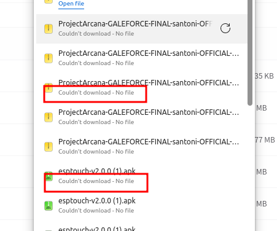
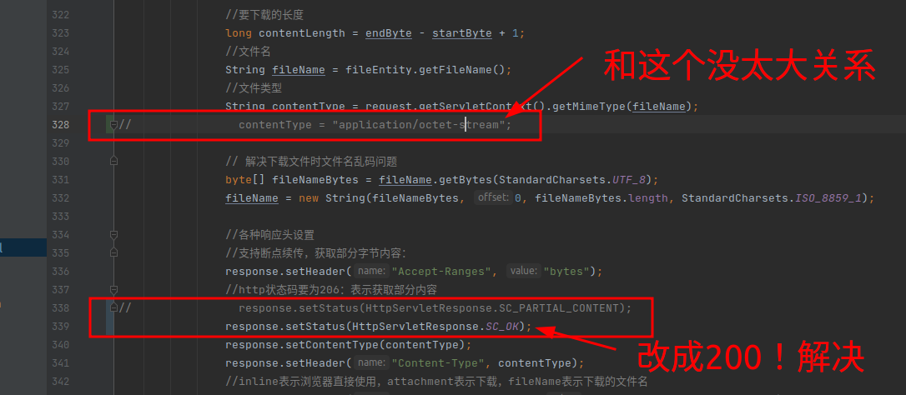

文件支持断点下载
===

代码参考

[FileServiceImpl](src/main/java/hxy/dragon/service/impl/FileServiceImpl.java)

测试出现一个问题:对于PDF，mp3文件，图片文件都可以正常打开。但是其他文件
就是火狐，夸克浏览器能正常断点下载，没有问题。但是Chrome和Edge就不可以了。报下面错误。




同时服务器报错如下：

```java
org.apache.catalina.connector.ClientAbortException: java.io.IOException: Connection reset by peer
	at org.apache.catalina.connector.OutputBuffer.realWriteBytes(OutputBuffer.java:353)
	at org.apache.catalina.connector.OutputBuffer.flushByteBuffer(OutputBuffer.java:783)
	at org.apache.catalina.connector.OutputBuffer.append(OutputBuffer.java:688)
	at org.apache.catalina.connector.OutputBuffer.writeBytes(OutputBuffer.java:388)
	at org.apache.catalina.connector.OutputBuffer.write(OutputBuffer.java:366)
	at org.apache.catalina.connector.CoyoteOutputStream.write(CoyoteOutputStream.java:96)
	at java.base/java.io.BufferedOutputStream.flushBuffer(BufferedOutputStream.java:81)
	at java.base/java.io.BufferedOutputStream.write(BufferedOutputStream.java:127)
	at hxy.dragon.service.impl.FileServiceImpl.downloadByFileId(FileServiceImpl.java:359)
	at hxy.dragon.controller.FileController.download(FileController.java:66)
	at java.base/jdk.internal.reflect.NativeMethodAccessorImpl.invoke0(Native Method)
	at java.base/jdk.internal.reflect.NativeMethodAccessorImpl.invoke(NativeMethodAccessorImpl.java:62)
	at java.base/jdk.internal.reflect.DelegatingMethodAccessorImpl.invoke(DelegatingMethodAccessorImpl.java:43)
	at java.base/java.lang.reflect.Method.invoke(Method.java:566)
	at org.springframework.web.method.support.InvocableHandlerMethod.doInvoke(InvocableHandlerMethod.java:205)
	at org.springframework.web.method.support.InvocableHandlerMethod.invokeForRequest(InvocableHandlerMethod.java:150)
	at org.springframework.web.servlet.mvc.method.annotation.ServletInvocableHandlerMethod.invokeAndHandle(ServletInvocableHandlerMethod.java:117)
	at org.springframework.web.servlet.mvc.method.annotation.RequestMappingHandlerAdapter.invokeHandlerMethod(RequestMappingHandlerAdapter.java:895)
	at org.springframework.web.servlet.mvc.method.annotation.RequestMappingHandlerAdapter.handleInternal(RequestMappingHandlerAdapter.java:808)
	at org.springframework.web.servlet.mvc.method.AbstractHandlerMethodAdapter.handle(AbstractHandlerMethodAdapter.java:87)
	at org.springframework.web.servlet.DispatcherServlet.doDispatch(DispatcherServlet.java:1067)
	at org.springframework.web.servlet.DispatcherServlet.doService(DispatcherServlet.java:963)
	at org.springframework.web.servlet.FrameworkServlet.processRequest(FrameworkServlet.java:1006)
	at org.springframework.web.servlet.FrameworkServlet.doGet(FrameworkServlet.java:898)
	at javax.servlet.http.HttpServlet.service(HttpServlet.java:655)
	at org.springframework.web.servlet.FrameworkServlet.service(FrameworkServlet.java:883)
	at javax.servlet.http.HttpServlet.service(HttpServlet.java:764)
	at org.apache.catalina.core.ApplicationFilterChain.internalDoFilter(ApplicationFilterChain.java:227)
	at org.apache.catalina.core.ApplicationFilterChain.doFilter(ApplicationFilterChain.java:162)
	at org.apache.tomcat.websocket.server.WsFilter.doFilter(WsFilter.java:53)
	at org.apache.catalina.core.ApplicationFilterChain.internalDoFilter(ApplicationFilterChain.java:189)
	at org.apache.catalina.core.ApplicationFilterChain.doFilter(ApplicationFilterChain.java:162)
	at org.springframework.web.filter.RequestContextFilter.doFilterInternal(RequestContextFilter.java:100)
	at org.springframework.web.filter.OncePerRequestFilter.doFilter(OncePerRequestFilter.java:117)
	at org.apache.catalina.core.ApplicationFilterChain.internalDoFilter(ApplicationFilterChain.java:189)
	at org.apache.catalina.core.ApplicationFilterChain.doFilter(ApplicationFilterChain.java:162)
	at org.springframework.web.filter.FormContentFilter.doFilterInternal(FormContentFilter.java:93)
	at org.springframework.web.filter.OncePerRequestFilter.doFilter(OncePerRequestFilter.java:117)
	at org.apache.catalina.core.ApplicationFilterChain.internalDoFilter(ApplicationFilterChain.java:189)
	at org.apache.catalina.core.ApplicationFilterChain.doFilter(ApplicationFilterChain.java:162)
	at org.springframework.web.filter.CharacterEncodingFilter.doFilterInternal(CharacterEncodingFilter.java:201)
	at org.springframework.web.filter.OncePerRequestFilter.doFilter(OncePerRequestFilter.java:117)
	at org.apache.catalina.core.ApplicationFilterChain.internalDoFilter(ApplicationFilterChain.java:189)
	at org.apache.catalina.core.ApplicationFilterChain.doFilter(ApplicationFilterChain.java:162)
	at org.apache.catalina.core.StandardWrapperValve.invoke(StandardWrapperValve.java:197)
	at org.apache.catalina.core.StandardContextValve.invoke(StandardContextValve.java:97)
	at org.apache.catalina.authenticator.AuthenticatorBase.invoke(AuthenticatorBase.java:540)
	at org.apache.catalina.core.StandardHostValve.invoke(StandardHostValve.java:135)
	at org.apache.catalina.valves.ErrorReportValve.invoke(ErrorReportValve.java:92)
	at org.apache.catalina.core.StandardEngineValve.invoke(StandardEngineValve.java:78)
	at org.apache.catalina.connector.CoyoteAdapter.service(CoyoteAdapter.java:357)
	at org.apache.coyote.http11.Http11Processor.service(Http11Processor.java:382)
	at org.apache.coyote.AbstractProcessorLight.process(AbstractProcessorLight.java:65)
	at org.apache.coyote.AbstractProtocol$ConnectionHandler.process(AbstractProtocol.java:895)
	at org.apache.tomcat.util.net.NioEndpoint$SocketProcessor.doRun(NioEndpoint.java:1732)
	at org.apache.tomcat.util.net.SocketProcessorBase.run(SocketProcessorBase.java:49)
	at org.apache.tomcat.util.threads.ThreadPoolExecutor.runWorker(ThreadPoolExecutor.java:1191)
	at org.apache.tomcat.util.threads.ThreadPoolExecutor$Worker.run(ThreadPoolExecutor.java:659)
	at org.apache.tomcat.util.threads.TaskThread$WrappingRunnable.run(TaskThread.java:61)
	at java.base/java.lang.Thread.run(Thread.java:829)
Caused by: java.io.IOException: Connection reset by peer
	at java.base/sun.nio.ch.FileDispatcherImpl.write0(Native Method)
	at java.base/sun.nio.ch.SocketDispatcher.write(SocketDispatcher.java:47)
	at java.base/sun.nio.ch.IOUtil.writeFromNativeBuffer(IOUtil.java:113)
	at java.base/sun.nio.ch.IOUtil.write(IOUtil.java:79)
	at java.base/sun.nio.ch.IOUtil.write(IOUtil.java:50)
	at java.base/sun.nio.ch.SocketChannelImpl.write(SocketChannelImpl.java:462)
	at org.apache.tomcat.util.net.NioChannel.write(NioChannel.java:135)
	at org.apache.tomcat.util.net.NioEndpoint$NioSocketWrapper.doWrite(NioEndpoint.java:1373)
	at org.apache.tomcat.util.net.SocketWrapperBase.doWrite(SocketWrapperBase.java:766)
	at org.apache.tomcat.util.net.SocketWrapperBase.writeBlocking(SocketWrapperBase.java:586)
	at org.apache.tomcat.util.net.SocketWrapperBase.write(SocketWrapperBase.java:530)
	at org.apache.coyote.http11.Http11OutputBuffer$SocketOutputBuffer.doWrite(Http11OutputBuffer.java:547)
	at org.apache.coyote.http11.filters.IdentityOutputFilter.doWrite(IdentityOutputFilter.java:73)
	at org.apache.coyote.http11.Http11OutputBuffer.doWrite(Http11OutputBuffer.java:194)
	at org.apache.coyote.Response.doWrite(Response.java:615)
	at org.apache.catalina.connector.OutputBuffer.realWriteBytes(OutputBuffer.java:340)
	... 59 common frames omitted
```

经过尝试，仔细分析，最终定位出来是http协议的http_status设置有问题。改成200即可，可能是Chrome和Edge不支持206，具体有待调查。
