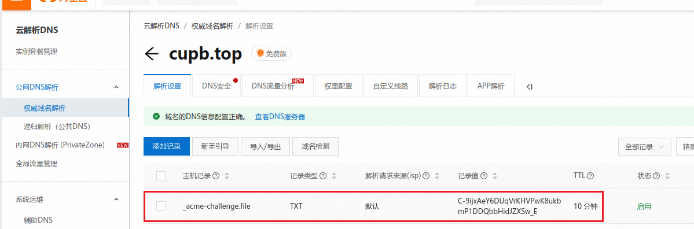
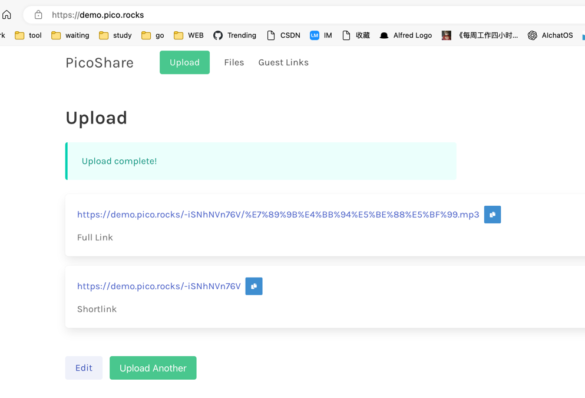
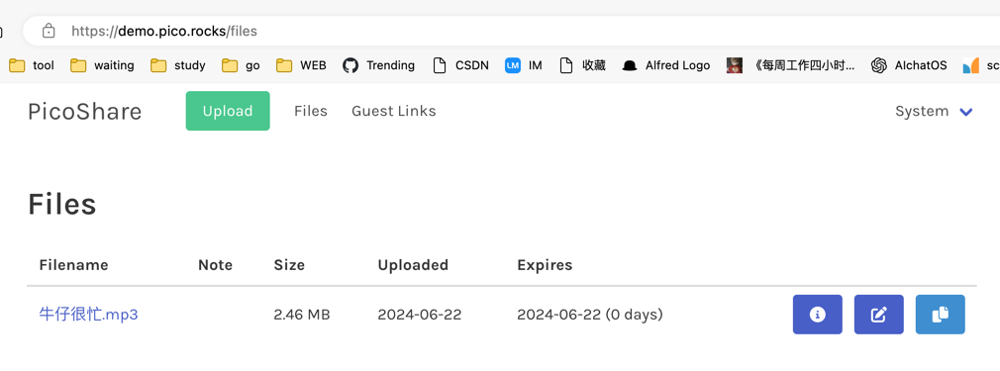
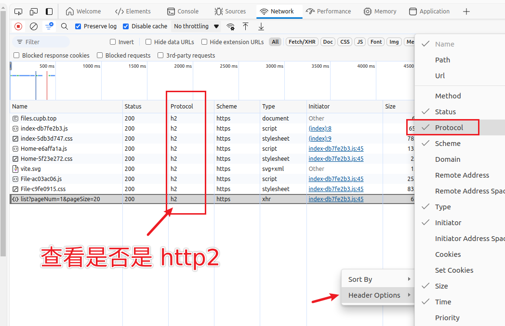

air-share
===

[【腾讯文档】局域网无法访问本机端口](https://docs.qq.com/doc/DSGplRmttZEt6d3lx)

```shell
git remote set-url --add origin git@github.com:aohanhongzhi/air-share.git
```

## IDEA启动执行

```shell
git pull origin $(git rev-parse --abbrev-ref HEAD)
```

支持jdk21

# 目前实现的功能

1. 分块上传
2. 并发上传
3. 断点续传
4. 断点下载

[基于 Vue + Element plus + Node 实现大文件分片上传，断点续传和秒传的功能！牛哇~](https://mp.weixin.qq.com/s/JRS0iw8KmetEznVo6ok_pg)

# 证书配置

```shell
/home/insite/.acme.sh/acme.sh --install-cert -d files.cupb.top \
	--key-file       /mnt/resource/data/docker/nginx/config/files.cupb.top/private.key  \
	--fullchain-file /mnt/resource/data/docker/nginx/config/files.cupb.top/full_chain.pem \
	--reloadcmd     "docker exec -it  nginx-rblc nginx -s reload"
```

105服务器

```shell
~/.acme.sh/acme.sh --issue -d file.cupb.top --dns dns_ali --debug
```



```shell
/home/rblc/.acme.sh/acme.sh --install-cert -d file.cupb.top \
	--key-file       /media/data/docker/nginx/config/nginx/cert/file.cupb.top/private.key  \
	--fullchain-file /media/data/docker/nginx/config/nginx/cert/file.cupb.top/full_chain.pem \
	--reloadcmd     "docker exec -it  nginx-rblc nginx -s reload"
```

# 类似开源实现

## 练手项目

https://gitee.com/Gary2016/minio-upload

## 简单版本-纯静态服务

### miniserve

Rustlang 开发的

就是静态文件服务器，不能长传文件。

https://github.com/svenstaro/miniserve

### sharing

只有下载，不能上传，类似nginx的静态文件服务器

https://github.com/parvardegr/sharing

### FList

将 GitHub Releases,Hugging Face,文件url等，渲染成类似网盘的文件列表显示在网页上，方便用户下载开源软件。 支持视频、音频、图片、PDF
等文件的在线预览。

https://github.com/jianjianai/FList

### python的http.server

只能查看文件列表

```
python3 -m http.server -b 192.168.0.118 8080
```

### pairdrop

https://github.com/schlagmichdoch/pairdrop

https://pairdrop.net/

### share

https://github.com/beavailable/share

### folder-share

https://gitee.com/folder-share

### croc

命令行传输文件，端到端加密

https://github.com/schollz/croc

## 简单版本-可以上传下载删除

### go-file

https://github.com/songquanpeng/go-file

### dufs

Rust开发的，小型的够用。

A file server that supports static serving, uploading, searching, accessing control, webdav..

https://github.com/sigoden/dufs.git

### filegator

PHP 开发的。

FileGator is a free, open-source, self-hosted web application for managing files and folders.

https://github.com/filegator/filegator

https://filegator.io/

### FileTransfer

P2P 局域网文件传输

https://github.com/WindRunnerMax/FileTransfer

https://webrtc.touchczy.top/


### WebRTC的文件传输

https://github.com/tl-open-source/tl-rtc-file

### Syncthing 60.4k

支持P2P的形式

Open Source Continuous File Synchronization

https://github.com/syncthing/syncthing

https://mp.weixin.qq.com/s/gHQzT9pJySQlY0UBpb57rQ

### send

基于 Bitiful S4 对象存储的 “Simul-Transfer（即传即收）” 技术实现的大文件实时多人分享，Wetransfer 或 奶牛快传 的相似开源替代品。

https://send.bitiful.com/

https://github.com/bitiful/send

### sharedrop

Easy P2P file transfer powered by WebRTC - inspired by Apple AirDrop

https://github.com/szimek/sharedrop

### picoshare 2.2k

Golang开发的

https://github.com/mtlynch/picoshare





### free-fs

这个如果是小团队，应该也可以的。重点是可以对接aliyun OSS

Free-Fs 开源文件管理系统：基于 SpringBoot3.x + MyBatis Flex + MySQL + Sa-Token + Layui 等搭配阿里云Oss、Minio、七牛云等各种云存储实现的云存储管理系统。 ✨Free-Fs 开源文件管理系统：基于 SpringBoot3.x + MyBatis Flex + MySQL + Sa-Token + Layui 等搭配阿里云OSS、Minio、七牛云等各种云存储实现的云存储管理系统。 包含文件上传、删除、在线预览、云资源列表查询、下载、文件移动、重命名、目录管理、登录、注册、以及权限控制等功能。

https://gitee.com/xddcode/free-fs

https://github.com/xddcode/free-fs

### PasswordPusher

密码传输工具，也可以传输文件

https://github.com/pglombardo/PasswordPusher

## 企业级推荐

### alist

https://github.com/alist-org/alist 38k

https://alist.nn.ci/

1. 可以选择各种云盘【阿里云盘官网推荐】，[webdav](https://alist.nn.ci/zh/guide/webdav.html#webdav-%E5%AD%98%E5%82%A8%E6%94%AF%E6%8C%81)
或者本地磁盘作为存储。

2. 支持加密存储。https://alist.nn.ci/zh/guide/drivers/Crypt.html https://www.bilibili.com/video/BV1h94y1W794/
3. [既支持作为webdav客户端使用，同时也可以作为**webdav服务器使用
   **](https://alist.nn.ci/zh/guide/webdav.html#webdav-%E5%AD%98%E5%82%A8%E6%94%AF%E6%8C%81)
   ，使用看视频 https://www.bilibili.com/video/BV1r14y1n7A7
4. 支持游客访问，只能下载。
5. 提供api，方便再次开发服务，源码开源。
6. 支持离线下载，非常适合下载任务多的。
7. 各种文件预览，视频等。


[检测文件是否上传过，对于已经上传的文件给出文件位置提示。或者移动文件到指定文件夹。](https://github.com/alist-org/alist/discussions/6561)

[利用rclone来检测重复文件](https://rclone.cn/rclone_dedupe.html)

### filebrowser 24.1k

功能比较完善的网盘，可以作为家庭NSA使用。

https://github.com/filebrowser/filebrowser

https://filebrowser.org

线上部署

http://disk.cupb.top/

### Cloudreve 23.9k

功能也非常完善。还支持市面常见的远程云存储。

Golang + React开发的前后端分离。

https://github.com/cloudreve/Cloudreve

Demo

https://demo.cloudreve.org/login

### jmal-cloud-server

JmalCloud除了常规网盘的文件管理、文档在线预览编辑之外，还支持外部OSS存储，还自带一个博客系统。支持 WebDAV 协议，可将 JmalCloud 挂载为本地磁盘。

• 项目源码：https://github.com/jamebal/jmal-cloud-server
• 项目官网：https://jmalcloud.github.io/
• 官方演示地址：https://jmal.cc/demo/


### OxiCloud

OxiCloud server, efficient and secure way to save all your data

OxiCloud是一款类似 NextCloud 的文件存储系统，采用 Rust 语言构建，从一开始就以性能、安全性和可扩展性作为其核心设计原则。非常适合自行搭建个人云存储，或在企业环境中部署使用。

✨ 主要特点

🔥 极速性能：使用 Rust 语言构建，并针对速度进行了优化
📁 高级文件管理：直观的文件夹结构，搭配强大的批量操作功能
🔄 并发处理：支持对大文件和批量处理进行并行文件操作
🔍 智能缓存：针对元数据和文件访问的多层缓存系统
🌐 国际化：全面支持国际化（目前支持英语和西班牙语）
📱 响应式设计：在桌面设备和移动设备上都能无缝使用
🔌 可扩展架构：遵循领域驱动原则的简洁分层设计

https://github.com/DioCrafts/OxiCloud

### Nimbus

An open source alternative to Google Drive, One Drive, iCloud, etc.

https://github.com/logscore/Nimbus

### localsend

https://localsend.org

#### flix

基于 localsend二次开发的，界面更加美化。

https://flix.center/

#### 闪电藤

基于 localsend二次开发的，功能更丰富。

https://sdt.zishu.life


#### nitroshare

代码好多年没有更新了。

类似LocalSend的跨平台传文件

Cross-platform application for transferring files across a local network.

https://nitroshare.net/

https://github.com/nitroshare


### tagspaces 3.5k

TagSpaces is an offline, open source, document manager with tagging support

www.tagspaces.org

https://github.com/tagspaces/tagspaces

### pingvin-share 2.1k

文件共享平台，看起来还不错。有账户体系。

https://github.com/stonith404/pingvin-share

Demo

https://pingvin-share.dev.eliasschneider.com/

### Airclap

linux正在规划中

https://airclap.app/

https://github.com/Gentleflow/Airclap

### 奇文网盘 2.3k

基于SpringBoot开发

https://gitee.com/qiwen-cloud/qiwen-file

### zfile

https://github.com/zfile-dev/zfile

## 商业化应用

### FastSend

P2P transfer

FastSend 是一个基于 WebRTC 技术的点对点（P2P）文件传输工具，支持快速的目录同步和文件传输。通过浏览器即可实现安全、高效的文件共享。

https://fastsend.ing/

https://github.com/ShouChenICU/FastSend

### EasyShare

ivo开发的

http://esin.vivo.com/

http://as.vivo.com/

# 热重启

https://github.com/HotswapProjects/HotswapAgent

VM 参数

```shell
-XX:+AllowEnhancedClassRedefinition -XX:HotswapAgent=fatjar
```

支持jdk21


#### 介绍

文件分享或者传输中心。可以对标：https://airportal.cn/。
私有化部署。


#### 软件架构

软件架构说明

第一版本采用SpringBoot的SpringWeb构建，后期采用SpringWebFlux构建。采用Netty做领拷贝。

前端采用 https://www.openzui.com/ 支持文件上传分片。

后期需要加上文件断点上传。

### Fleet开发


### 部署

启动
```shell
./gradlew clean bootRun -x test   --args='--spring.profiles.active=beta'
```

> https://docs.spring.io/spring-boot/gradle-plugin/running.html

```shell
./gradlew clean bootJar -x test
```

```shell
gradlew.bat clean bootJar -x test
```

```shell
ssh insite@insite.cupb.top
```

上传到服务器

```shell
scp build/libs/air-share-0.0.1-SNAPSHOT.jar insite@file.cupb.top:/home/insite/app/
```

上传数据库

```shell
scp airshare.db insite@insite.cupb.top:/home/insite/app/
```

启动

```shell
nohup /opt/jbr/bin/java -Dfile.encoding=utf-8 -Duser.timezone=GMT+08  -jar /home/insite/app/air-share-0.0.1-SNAPSHOT.jar --spring.profiles.active=prod -Xmx1G -Xms512M -server -XX:+UseG1GC -XX:+HeapDumpOnOutOfMemoryError >>/home/insite/app/air-share.log  2>&1 &
```

```shell
nohup /opt/jbr/bin/java -Dfile.encoding=utf-8 -Duser.timezone=GMT+08 -XX:+HeapDumpOnOutOfMemoryError -jar /home/insite/app/air-share-0.0.1-SNAPSHOT.jar --spring.profiles.active=prod --hxy.print.absolute-file-path=/mnt/resource/data/air-share --spring.datasource.url=jdbc:sqlite:/home/insite/app/airshare.db -Xmx1G -Xms512M -server -XX:+UseG1GC >> /home/insite/app/air-share.log 2>&1 &
```

服务器显示日志调试

```shell
/media/data/jdk/bin/java -Dfile.encoding=utf-8 -Duser.timezone=GMT+08 -XX:+HeapDumpOnOutOfMemoryError -jar /home/insite/app/air-share-0.0.1-SNAPSHOT.jar --spring.profiles.active=beta --hxy.print.absolute-file-path=/media/data/data/air-share/air-share
```

# docker启动nginx

```shell
docker run -d -p 80:80 -p 443:443 --name rblc-nginx1 -v  /mnt/resource/data/docker/nginx/www:/usr/share/nginx -v /mnt/resource/data/docker/nginx/config/:/etc/nginx/ nginx
```

docker run -d -p 80:80 -p 443:443 --name rblc-nginx1 -v /mnt/resource/data/docker/nginx/www:/usr/share/nginx -v
/mnt/resource/data/docker/nginx/config/:/etc/nginx/ nginx


```shell
vim /mnt/resource/data/docker/nginx/config/conf.d/default.conf
```

```shell
docker exec -it  nginx-rblc nginx -t
docker exec -it  nginx-rblc nginx -s reload

```

```nginx配置

server {
    listen       80;
    listen  [::]:80;
    server_name files.cupb.top;

    location / {
         root /usr/share/nginx/html/dist;
         index  index.html index.htm;
    }
    location /api/ {
        proxy_set_header HOST $host;
        proxy_set_header X-Forwarded-Proto $scheme;
        proxy_set_header X-Real-IP $remote_addr;
        proxy_set_header X-Forwarded-For $proxy_add_x_forwarded_for;
        proxy_pass http://10.2.0.4:8888/;
        proxy_next_upstream error timeout invalid_header http_500 http_503 http_404;
    }


}


server {
    listen     443  ssl http2;
    server_name  files.cupb.top;
    add_header Cache-Control no-store;
    add_header Cache-Control private;

    ssl_certificate    /etc/nginx/files.cupb.top/files.cupb.top.pem;
    ssl_certificate_key   /etc/nginx/files.cupb.top/files.cupb.top.key;

    # ssl_certificate    /etc/nginx/files.cupb.top_ecc/fullchain.cer;
    # ssl_certificate_key   /etc/nginx/files.cupb.top_ecc/files.cupb.top.key;

    ssl_session_cache    shared:SSL:1m;
    ssl_session_timeout  5m;

    ssl_protocols TLSv1.3;
    ssl_ciphers ECDHE-RSA-AES128-GCM-SHA256:HIGH:!aNULL:!MD5:!RC4:!DHE;
    ssl_prefer_server_ciphers  on;

    location / {
         root /usr/share/nginx/html/dist;
         index  index.html index.htm;
    }
    location /api/ {
        proxy_set_header HOST $host;
        proxy_set_header X-Forwarded-Proto $scheme;
        proxy_set_header X-Real-IP $remote_addr;
        proxy_set_header X-Forwarded-For $proxy_add_x_forwarded_for;
        proxy_pass http://10.2.0.4:8888/;
        proxy_next_upstream error timeout invalid_header http_500 http_503 http_404;
    }


    error_page   500 502 503 504  /50x.html;
    location = /50x.html {
        root   html;
    }
}

```

迁移到105服务器

```nginx配置

server {
    listen       80;
    listen  [::]:80;
    server_name file.cupb.top;

    location / {
         root /usr/share/nginx/airshare;
         index  index.html index.htm;
    }
    location /api/ {
        proxy_set_header HOST $host;
        proxy_set_header X-Forwarded-Proto $scheme;
        proxy_set_header X-Real-IP $remote_addr;
        proxy_set_header X-Forwarded-For $proxy_add_x_forwarded_for;
        proxy_pass http://10.2.0.5:8888/;
        proxy_next_upstream error timeout invalid_header http_500 http_503 http_404;
    }

}


server {
    listen     443  ssl;
    http2 on;
    
    server_name  file.cupb.top;
    add_header Cache-Control no-store;
    add_header Cache-Control private;

    ssl_certificate    /etc/nginx/cert/file.cupb.top/full_chain.pem;
    ssl_certificate_key   /etc/nginx/cert/file.cupb.top/private.key;
    
    ssl_session_cache    shared:SSL:1m;
    ssl_session_timeout  5m;

    ssl_protocols TLSv1.3;
    ssl_ciphers ECDHE-RSA-AES128-GCM-SHA256:HIGH:!aNULL:!MD5:!RC4:!DHE;
    ssl_prefer_server_ciphers  on;

    location / {
         root /usr/share/nginx/airshare;
         index  index.html index.htm;
    }
    location /api/ {
        proxy_set_header HOST $host;
        proxy_set_header X-Forwarded-Proto $scheme;
        proxy_set_header X-Real-IP $remote_addr;
        proxy_set_header X-Forwarded-For $proxy_add_x_forwarded_for;
        proxy_pass http://10.2.0.5:8888/;
        proxy_next_upstream error timeout invalid_header http_500 http_503 http_404;
    }


    error_page   500 502 503 504  /50x.html;
    location = /50x.html {
        root   html;
    }
}

```


迁移到89服务器

```nginx配置

server {
    listen       80;
    listen  [::]:80;
    server_name file.bosch-smartlife.com;

    location / {
         root /usr/share/nginx/airshare;
         index  index.html index.htm;
    }
    location /api/ {
        proxy_set_header HOST $host;
        proxy_set_header X-Forwarded-Proto $scheme;
        proxy_set_header X-Real-IP $remote_addr;
        proxy_set_header X-Forwarded-For $proxy_add_x_forwarded_for;
        proxy_pass http://10.5.0.8:8888/;
        proxy_next_upstream error timeout invalid_header http_500 http_503 http_404;
    }

}


server {
    listen     443  ssl;
    http2 on;
    
    server_name  file.bosch-smartlife.com;
    add_header Cache-Control no-store;
    add_header Cache-Control private;

    ssl_certificate    /etc/nginx/8492630__bosch-smartlife.com_nginx/bosch-smartlife.com.pem;
    ssl_certificate_key   /etc/nginx/8492630__bosch-smartlife.com_nginx/bosch-smartlife.com.key;
    
    ssl_session_cache    shared:SSL:1m;
    ssl_session_timeout  5m;

    ssl_protocols TLSv1.3;
    ssl_ciphers ECDHE-RSA-AES128-GCM-SHA256:HIGH:!aNULL:!MD5:!RC4:!DHE;
    ssl_prefer_server_ciphers  on;

    location / {
         root /usr/share/nginx/airshare;
         index  index.html index.htm;
    }
    location /api/ {
        proxy_set_header HOST $host;
        proxy_set_header X-Forwarded-Proto $scheme;
        proxy_set_header X-Real-IP $remote_addr;
        proxy_set_header X-Forwarded-For $proxy_add_x_forwarded_for;
        proxy_pass http://10.5.0.8:8888/;
        proxy_next_upstream error timeout invalid_header http_500 http_503 http_404;
    }


    error_page   500 502 503 504  /50x.html;
    location = /50x.html {
        root   html;
    }
}

```


查看是否是 http2协议



服务器内存占用

第一次观察


400720KB / 1024 = 391MB

第二次观察


484202KB / 1024 = 472MB

也就是air-share启动的时候占用了 391MB的内存，显然这么个小程序占用这么大的内存着实有点浪费了，这也是SpringBoot非常占用内存的名声来源了。

```shell
ps aux |grep air
```


下图是 air-share(SpringBoot)和[filebrowser](https://github.com/filebrowser/filebrowser)(Go)
的对比。filebrowser的功能要比air-share更加丰富，但是内存只有26分之一。

# 学习

[SpringBoot SpringMVC文件下载，大文件断点续传，可以实时播放视频,拖动进度条](https://blog.csdn.net/qq_41389354/article/details/105043312)

# 性能监控

不支持SpringBoot3，也不支持java9+

http://localhost:8888/koTime

http://files.cupb.top/api/koTime


