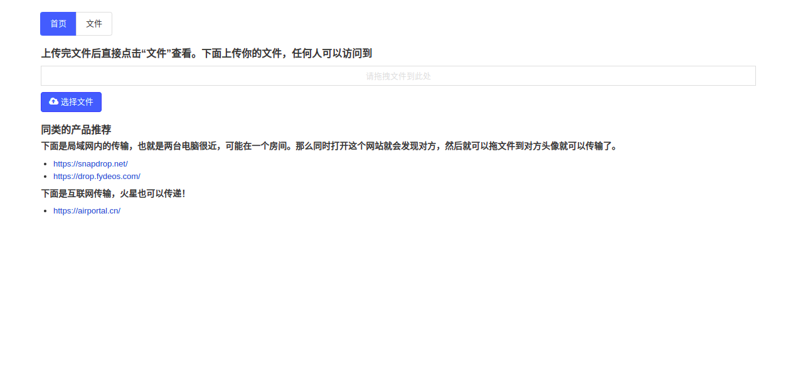
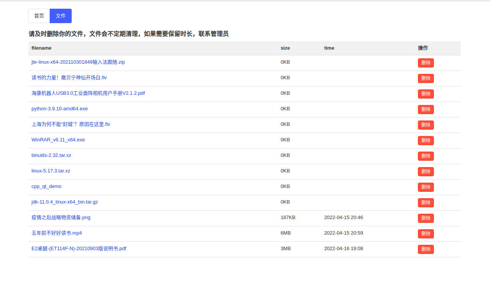

# air-share


#### 介绍
文件分享或者传输中心。可以对标：https://airportal.cn/。
私有化部署。





#### 软件架构 
软件架构说明

第一版本采用SpringBoot的SpringWeb构建，后期采用SpringWebFlux构建。采用Netty做领拷贝。

前端采用 https://www.openzui.com/ 支持文件上传分片。

后期需要加上文件断点上传。


### 部署

```shell
./gradlew clean bootJar -x test
```

```shell
gradlew.bat clean bootJar -x test
```

```shell
ssh insite@insite.cupb.top
```
上传到服务器
```shell
scp build/libs/air-share-0.0.1-SNAPSHOT.jar insite@insite.cupb.top:/home/insite/app/
```
上传数据库
```shell
scp airshare.db insite@insite.cupb.top:/home/insite/app/
```

启动
```shell
nohup /opt/jbr/bin/java -Dfile.encoding=utf-8 -Duser.timezone=GMT+08  -jar /home/insite/app/air-share-0.0.1-SNAPSHOT.jar --spring.profiles.active=prod -Xmx1G -Xms512M -server -XX:+UseG1GC -XX:+HeapDumpOnOutOfMemoryError >>/home/insite/app/air-share.log  2>&1 &
```

```shell
nohup /opt/jbr/bin/java -Dfile.encoding=utf-8 -Duser.timezone=GMT+08 -XX:+HeapDumpOnOutOfMemoryError -jar /home/insite/app/air-share-0.0.1-SNAPSHOT.jar --spring.profiles.active=prod --hxy.print.absolute-file-path=/mnt/resource/data/air-share --spring.datasource.url=jdbc:sqlite:/home/insite/app/airshare.db -Xmx1G -Xms512M -server -XX:+UseG1GC >> /home/insite/app/air-share.log 2>&1 &
``` 


# 拓展

只能查看文件列表

```
python3 -m http.server -b 192.168.0.118 8080
```


# 其他类似轮子

https://github.com/beavailable/share

https://gitee.com/folder-share

