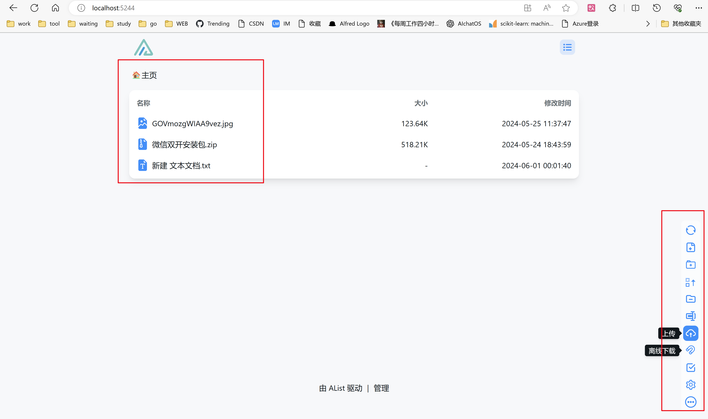
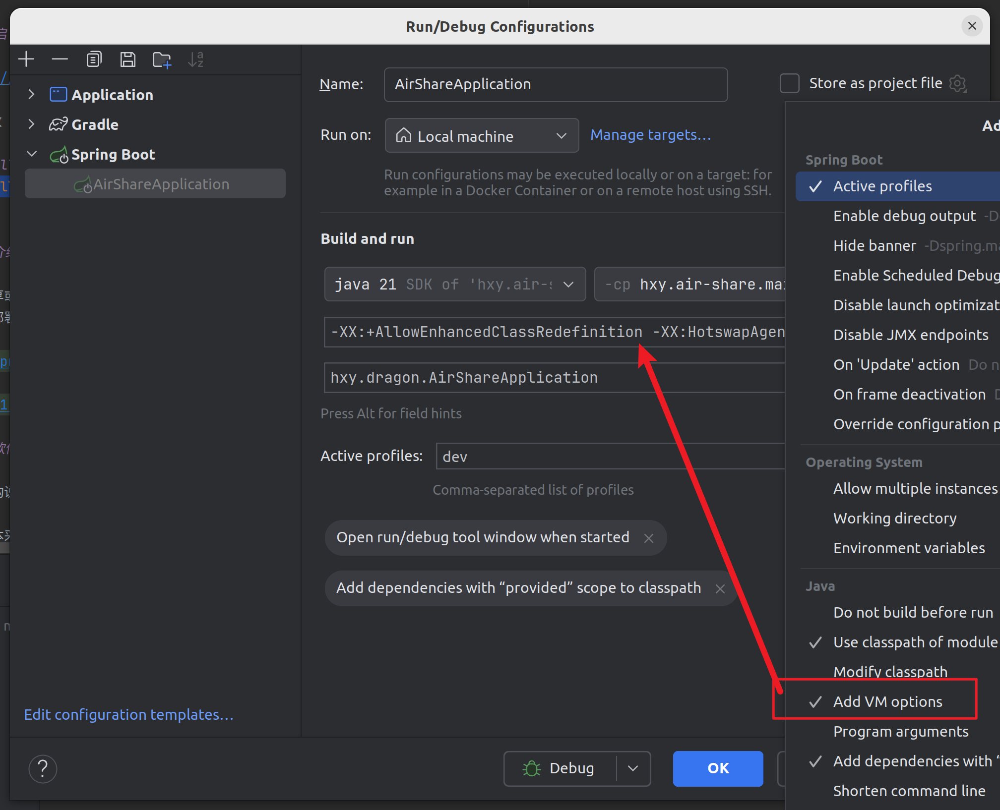
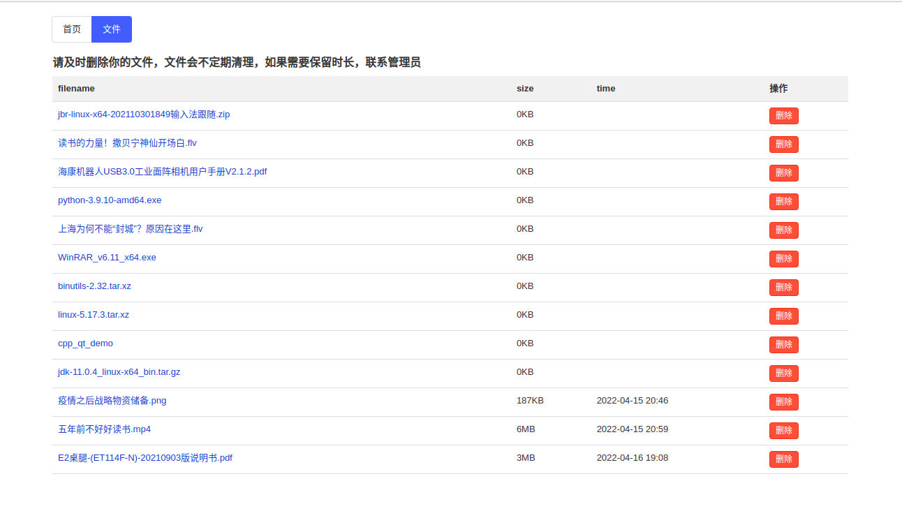
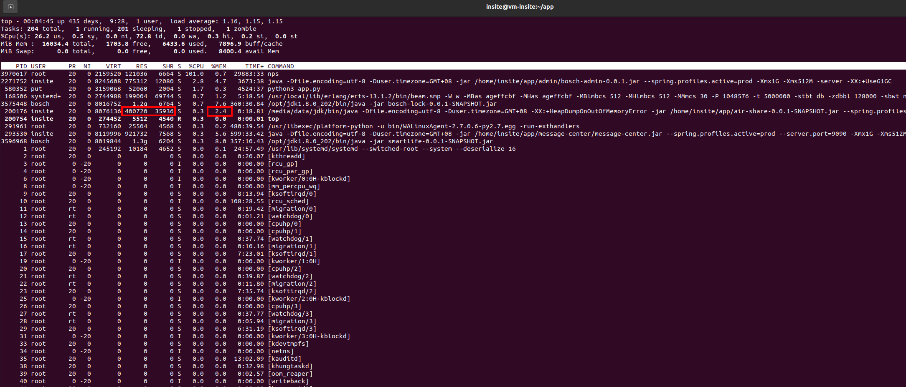
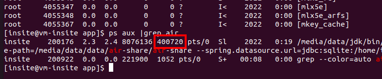
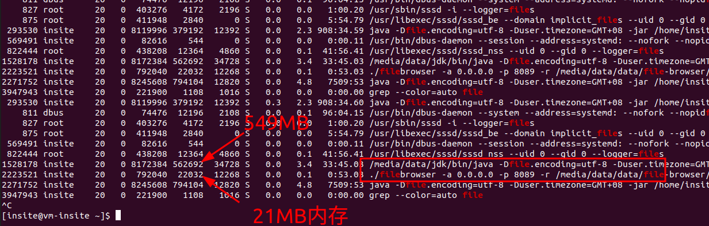
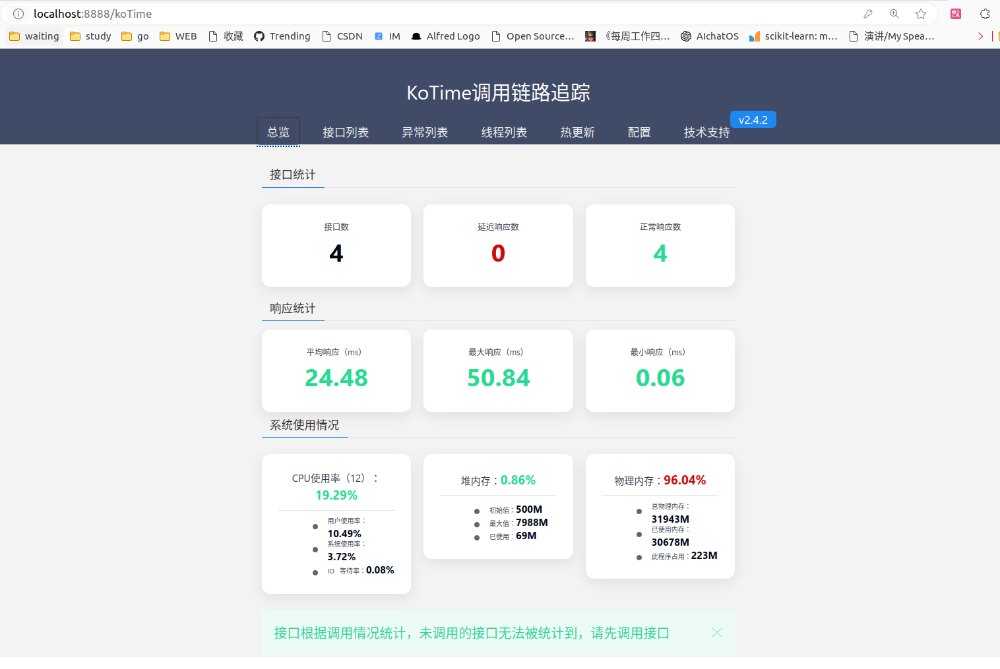

air-share
===

支持jdk21

# 目前实现的功能

1. 分块上传
3. 并发上传
2. 断点续传
2. 断点下载

# 类似开源实现

## 简单版本-纯静态服务


### miniserve

Rustlang开发的

就是静态文件服务器，不能长传文件。

https://github.com/svenstaro/miniserve

### sharing

只有下载，不能上传，类似nginx的静态文件服务器

https://github.com/parvardegr/sharing

### python的http.server

只能查看文件列表

```
python3 -m http.server -b 192.168.0.118 8080
```

### pairdrop

https://github.com/schlagmichdoch/pairdrop

https://pairdrop.net/

### share

https://github.com/beavailable/share

### folder-share

https://gitee.com/folder-share

### croc

命令行传输文件，端到端加密

https://github.com/schollz/croc

## 简单版本-可以上传下载删除

### dufs

Rust开发的，小型的够用。

A file server that supports static serving, uploading, searching, accessing control, webdav..

https://github.com/sigoden/dufs.git

### filegator

PHP 开发的。

FileGator is a free, open-source, self-hosted web application for managing files and folders.

https://github.com/filegator/filegator

https://filegator.io/

## 企业级推荐

### alist

https://github.com/alist-org/alist 38k

https://alist.nn.ci/

1. 可以选择各种云盘【阿里云盘官网推荐】，[webdav](https://alist.nn.ci/zh/guide/webdav.html#webdav-%E5%AD%98%E5%82%A8%E6%94%AF%E6%8C%81)或者本地磁盘作为存储。
2. [既支持作为webdav客户端使用，同时也可以作为**webdav服务器使用**](https://alist.nn.ci/zh/guide/webdav.html#webdav-%E5%AD%98%E5%82%A8%E6%94%AF%E6%8C%81)，使用看视频 https://www.bilibili.com/video/BV1r14y1n7A7
3. 支持游客访问，只能下载。
3. 提供api，方便再次开发服务，源码开源。
4. 支持离线下载，非常适合下载任务多的。
5. 各种文件预览，视频等。



[检测文件是否上传过，对于已经上传的文件给出文件位置提示。或者移动文件到指定文件夹。](https://github.com/alist-org/alist/discussions/6561)

### filebrowser 24.1k

功能比较完善的网盘，可以作为家庭NSA使用。

https://github.com/filebrowser/filebrowser

https://filebrowser.org

线上部署

http://disk.cupb.top/


### Cloudreve 20.7k

功能也非常完善。还支持市面常见的远程云存储。

Golang + React开发的前后端分离。

https://github.com/cloudreve/Cloudreve

Demo

https://demo.cloudreve.org/login

### localsend

https://localsend.org

### tagspaces 3.5k

TagSpaces is an offline, open source, document manager with tagging support

www.tagspaces.org

https://github.com/tagspaces/tagspaces

### pingvin-share 2.1k

文件共享平台，看起来还不错。有账户体系。

https://github.com/stonith404/pingvin-share

Demo

https://pingvin-share.dev.eliasschneider.com/

### Airclap

linux正在规划中

https://airclap.app/

https://github.com/Gentleflow/Airclap


## 商业化应用

### EasyShare

ivo开发的

http://esin.vivo.com/

http://as.vivo.com/

# 热重启

https://github.com/HotswapProjects/HotswapAgent

VM 参数

```shell
-XX:+AllowEnhancedClassRedefinition -XX:HotswapAgent=fatjar
```

支持jdk21



#### 介绍

文件分享或者传输中心。可以对标：https://airportal.cn/。
私有化部署。




#### 软件架构

软件架构说明

第一版本采用SpringBoot的SpringWeb构建，后期采用SpringWebFlux构建。采用Netty做领拷贝。

前端采用 https://www.openzui.com/ 支持文件上传分片。

后期需要加上文件断点上传。

### Fleet开发


### 部署

```shell
./gradlew clean bootJar -x test
```

```shell
gradlew.bat clean bootJar -x test
```

```shell
ssh insite@insite.cupb.top
```

上传到服务器

```shell
scp build/libs/air-share-0.0.1-SNAPSHOT.jar insite@file.cupb.top:/home/insite/app/
```

上传数据库

```shell
scp airshare.db insite@insite.cupb.top:/home/insite/app/
```

启动

```shell
nohup /opt/jbr/bin/java -Dfile.encoding=utf-8 -Duser.timezone=GMT+08  -jar /home/insite/app/air-share-0.0.1-SNAPSHOT.jar --spring.profiles.active=prod -Xmx1G -Xms512M -server -XX:+UseG1GC -XX:+HeapDumpOnOutOfMemoryError >>/home/insite/app/air-share.log  2>&1 &
```

```shell
nohup /opt/jbr/bin/java -Dfile.encoding=utf-8 -Duser.timezone=GMT+08 -XX:+HeapDumpOnOutOfMemoryError -jar /home/insite/app/air-share-0.0.1-SNAPSHOT.jar --spring.profiles.active=prod --hxy.print.absolute-file-path=/mnt/resource/data/air-share --spring.datasource.url=jdbc:sqlite:/home/insite/app/airshare.db -Xmx1G -Xms512M -server -XX:+UseG1GC >> /home/insite/app/air-share.log 2>&1 &
``` 

服务器显示日志调试

```shell
/media/data/jdk/bin/java -Dfile.encoding=utf-8 -Duser.timezone=GMT+08 -XX:+HeapDumpOnOutOfMemoryError -jar /home/insite/app/air-share-0.0.1-SNAPSHOT.jar --spring.profiles.active=beta --hxy.print.absolute-file-path=/media/data/data/air-share/air-share
```

# docker启动nginx

```shell
docker run -d -p 80:80 -p 443:443 --name rblc-nginx1 -v  /mnt/resource/data/docker/nginx/www:/usr/share/nginx -v /mnt/resource/data/docker/nginx/config/:/etc/nginx/ nginx
```

docker run -d -p 80:80 -p 443:443 --name rblc-nginx1 -v /mnt/resource/data/docker/nginx/www:/usr/share/nginx -v
/mnt/resource/data/docker/nginx/config/:/etc/nginx/ nginx

服务器内存占用

第一次观察



400720KB / 1024 = 391MB

第二次观察


484202KB / 1024 = 472MB

也就是air-share启动的时候占用了 391MB的内存，显然这么个小程序占用这么大的内存着实有点浪费了，这也是SpringBoot非常占用内存的名声来源了。

```shell
ps aux |grep air
```



下图是 air-share(SpringBoot)和[filebrowser](https://github.com/filebrowser/filebrowser)(Go)
的对比。filebrowser的功能要比air-share更加丰富，但是内存只有26分之一。



```shell
docker exec -it  nginx-rblc nginx -t
docker exec -it  nginx-rblc nginx -s reload

```

```nginx配置

server {
    listen       80;
    listen  [::]:80;
    server_name files.cupb.top;

    location / {
         root /usr/share/nginx/html/dist;
         index  index.html index.htm;
    }
    location /api/ {
        proxy_set_header HOST $host;
        proxy_set_header X-Forwarded-Proto $scheme;
        proxy_set_header X-Real-IP $remote_addr;
        proxy_set_header X-Forwarded-For $proxy_add_x_forwarded_for;
        proxy_pass http://10.2.0.4:8888/;
        proxy_next_upstream error timeout invalid_header http_500 http_503 http_404;
    }


}


server {
    listen     443  ssl http2;
    server_name  files.cupb.top;
    add_header Cache-Control no-store;
    add_header Cache-Control private;
           
    ssl_certificate    /etc/nginx/files.cupb.top/files.cupb.top.pem;
    ssl_certificate_key   /etc/nginx/files.cupb.top/files.cupb.top.key;

    # ssl_certificate    /etc/nginx/files.cupb.top_ecc/fullchain.cer;
    # ssl_certificate_key   /etc/nginx/files.cupb.top_ecc/files.cupb.top.key;

    ssl_session_cache    shared:SSL:1m;
    ssl_session_timeout  5m;

    ssl_protocols TLSv1.3;    
    ssl_ciphers ECDHE-RSA-AES128-GCM-SHA256:HIGH:!aNULL:!MD5:!RC4:!DHE;       
    ssl_prefer_server_ciphers  on;

    location / {
         root /usr/share/nginx/html/dist;
         index  index.html index.htm;
    }
    location /api/ {
        proxy_set_header HOST $host;
        proxy_set_header X-Forwarded-Proto $scheme;
        proxy_set_header X-Real-IP $remote_addr;
        proxy_set_header X-Forwarded-For $proxy_add_x_forwarded_for;
        proxy_pass http://10.2.0.4:8888/;
        proxy_next_upstream error timeout invalid_header http_500 http_503 http_404;
    }


    error_page   500 502 503 504  /50x.html;
    location = /50x.html {
        root   html;
    }
}

```

# 学习

[SpringBoot SpringMVC文件下载，大文件断点续传，可以实时播放视频,拖动进度条](https://blog.csdn.net/qq_41389354/article/details/105043312)

# 性能监控

不支持SpringBoot3，也不支持java9+

http://localhost:8888/koTime

http://files.cupb.top/api/koTime


