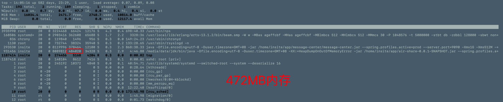

air-share
===

## 企业级推荐

功能比较完善

https://github.com/filebrowser/filebrowser

https://filebrowser.org

### 热重启

https://github.com/HotswapProjects/HotswapAgent

VM 参数

```shell
-XX:+AllowEnhancedClassRedefinition -XX:HotswapAgent=fatjar
```

#### 介绍
文件分享或者传输中心。可以对标：https://airportal.cn/。
私有化部署。


#### 软件架构 
软件架构说明

第一版本采用SpringBoot的SpringWeb构建，后期采用SpringWebFlux构建。采用Netty做领拷贝。

前端采用 https://www.openzui.com/ 支持文件上传分片。

后期需要加上文件断点上传。


### 部署

```shell
./gradlew clean bootJar -x test
```

```shell
gradlew.bat clean bootJar -x test
```

```shell
ssh insite@insite.cupb.top
```
上传到服务器
```shell
scp build/libs/air-share-0.0.1-SNAPSHOT.jar insite@file.cupb.top:/home/insite/app/
```
上传数据库
```shell
scp airshare.db insite@insite.cupb.top:/home/insite/app/
```

启动
```shell
nohup /opt/jbr/bin/java -Dfile.encoding=utf-8 -Duser.timezone=GMT+08  -jar /home/insite/app/air-share-0.0.1-SNAPSHOT.jar --spring.profiles.active=prod -Xmx1G -Xms512M -server -XX:+UseG1GC -XX:+HeapDumpOnOutOfMemoryError >>/home/insite/app/air-share.log  2>&1 &
```

```shell
nohup /opt/jbr/bin/java -Dfile.encoding=utf-8 -Duser.timezone=GMT+08 -XX:+HeapDumpOnOutOfMemoryError -jar /home/insite/app/air-share-0.0.1-SNAPSHOT.jar --spring.profiles.active=prod --hxy.print.absolute-file-path=/mnt/resource/data/air-share --spring.datasource.url=jdbc:sqlite:/home/insite/app/airshare.db -Xmx1G -Xms512M -server -XX:+UseG1GC >> /home/insite/app/air-share.log 2>&1 &
``` 

服务器显示日志调试

```shell
/media/data/jdk/bin/java -Dfile.encoding=utf-8 -Duser.timezone=GMT+08 -XX:+HeapDumpOnOutOfMemoryError -jar /home/insite/app/air-share-0.0.1-SNAPSHOT.jar --spring.profiles.active=beta --hxy.print.absolute-file-path=/media/data/data/air-share/air-share
```

# docker启动nginx

```shell
docker run -d -p 80:80 -p 443:443 --name rblc-nginx1 -v  /mnt/resource/data/docker/nginx/www:/usr/share/nginx -v /mnt/resource/data/docker/nginx/config/:/etc/nginx/ nginx
```

docker run -d -p 80:80 -p 443:443 --name rblc-nginx1 -v  /mnt/resource/data/docker/nginx/www:/usr/share/nginx -v /mnt/resource/data/docker/nginx/config/:/etc/nginx/ nginx


服务器内存占用

第一次观察


400720KB / 1024 = 391MB

第二次观察



484202KB / 1024 = 472MB

也就是air-share启动的时候占用了 391MB的内存，显然这么个小程序占用这么大的内存着实有点浪费了，这也是SpringBoot非常占用内存的名声来源了。


```shell
ps aux |grep air
```


下图是 air-share(SpringBoot)和[filebrowser](https://github.com/filebrowser/filebrowser)(Go)的对比。filebrowser的功能要比air-share更加丰富，但是内存只有26分之一。


```nginx配置
server {
    listen       80;
    listen  [::]:80;
    server_name file.bosch-smartlife.com;

    location / {
        #proxy_set_header HOST $host;
        #proxy_set_header X-Forwarded-Proto $scheme;
        #proxy_set_header X-Real-IP $remote_addr;
        #proxy_set_header X-Forwarded-For $proxy_add_x_forwarded_for;

        proxy_pass http://139.217.230.42:8888;
        proxy_next_upstream error timeout invalid_header http_500 http_503 http_404;
        #proxy_set_header Host $host:${server_port};
   }
}

server {
    listen       443 ssl;
    listen  [::]:443;
    server_name file.bosch-smartlife.com;

    location / {
        #配置反向代理地址
        proxy_pass http://139.217.230.42:8888;
        index  index.html index.htm;
        #proxy_redirect off;
        #proxy_set_header Host $http_host;
        #proxy_set_header X-Real-IP $remote_addr;
        #proxy_set_header X-Forwarded-For $proxy_add_x_forwarded_for;
   }
    error_page 401 403 404 /40x.html;
        location = /40x.html {
    }

    error_page 500 502 503 504 /50x.-html;
        location = /50x.html {
    }

   ssl_certificate /etc/nginx/conf.d/bosch-ssl/bosch-smartlife.com.pem;
   ssl_certificate_key /etc/nginx/conf.d/bosch-ssl/bosch-smartlife.com.key;
}

```


# TODO 
-[ ] 断点续传

# 拓展

只能查看文件列表

```
python3 -m http.server -b 192.168.0.118 8080
```


# 学习

[SpringBoot SpringMVC文件下载，大文件断点续传，可以实时播放视频,拖动进度条](https://blog.csdn.net/qq_41389354/article/details/105043312)

# 其他类似轮子

https://github.com/beavailable/share

https://gitee.com/folder-share

/media/data/data/air-share/air-share/2022-12-15


# 性能监控

http://localhost:8888/koTime

